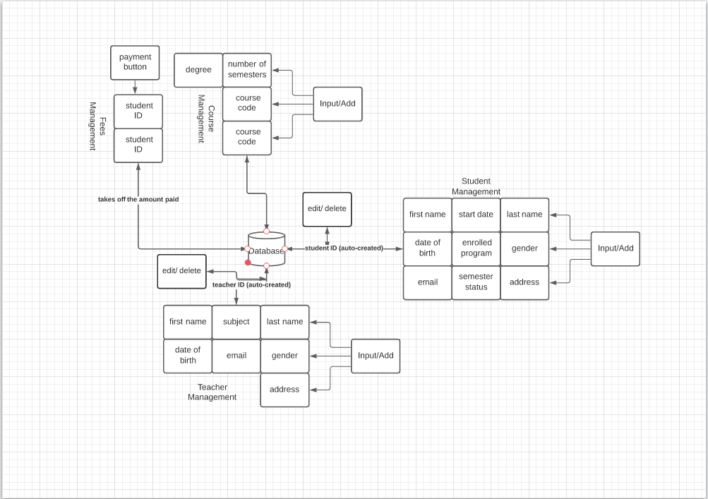

# CollegeManagementSystem

## Overview
A college management application that can manage students, teachers, courses and fees payment.

## Technologies
- C# .NET Framework
- MS Access Database

## Features
- Loading window with progress bar
- Login function
- Main menu which is entry for each tab
- Management tab
  1. Student management tab
    - CRUD function
  2. Teacher management tab
    - CRUD function
  3. Course management tab
    - CRUD function
  4. Course management tab
    - CRUD function
    
## Flowchart

